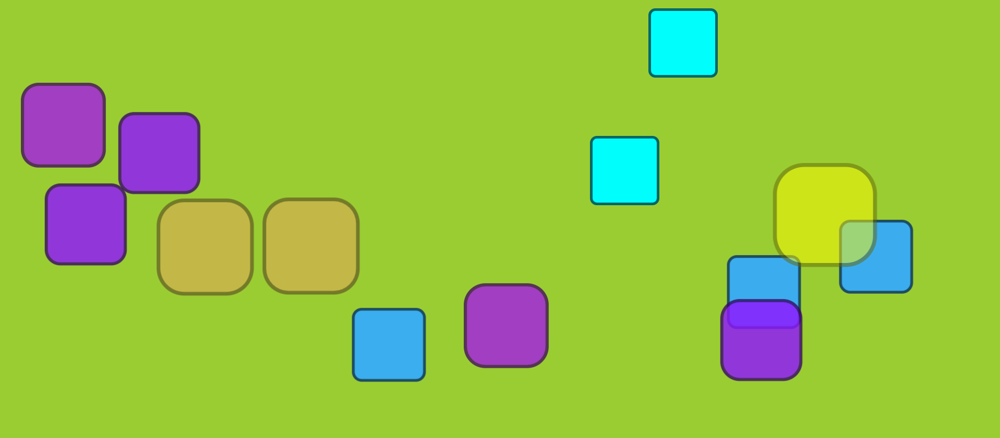

# 🎉 Drop Animation Theme

A simple and interactive drop animation effect that creates visually appealing random drops with animations on the screen. Perfect for creative backgrounds, UI effects, or as a starting point for interactive web animations.

## 🚀 Features

- **Interactive Drop Animation:** Animated, randomly sized, and randomly positioned drops.
- **Click-to-Interact:** Clicking a drop triggers a quick scaling effect.
- **Smooth Animation:** Smooth visual effects with fading and transitions.
- **Responsive Design:** Adapts well to different screen sizes.
- **Performance Optimized:** Limits the number of active animated elements to prevent slowdowns.

### **Screenshot**
Below is the screenshot showing the interactive drop animation effect in action:

 

## ✨ Key Highlights

1. **Randomized Position & Size:** Each drop appears at random positions with varying sizes to make the animation lively and dynamic.
2. **Click Effect:** Clicking on drops triggers a scale and color change.
3. **Fade-out Effect:** Drops are removed after completing their animation to maintain smooth performance.
4. **Responsive & Fluid:** Designed to adapt to different viewport sizes seamlessly.


## 💻 Technologies Used
- **HTML5**
- **CSS3**
- **JavaScript**


## 🛠️ How It Works

1. Randomly create `span` elements styled as drops at random positions on the viewport.
2. Animate each element using CSS animations for smooth scaling and motion.
3. Allow interaction by clicking the elements, triggering scaling and background effects.
4. Ensure drops are removed after animation completes or upon user interaction.


## 📄 Files & Structure

```plaintext
Drop-Animation-Theme/
│
├── index.html           # HTML structure
├── style.css           # Styling for animations
├── script.js           # Core JavaScript logic
└── README.md           # Documentation file
```

## 💡 Future Ideas
1. Add different types of animations.
2. Introduce multiple themes for the animation effects.
3. Make it fully interactive by introducing buttons to control the number of active drops or themes.


## 🤝 Contributing

Feel free to contribute!  
Fork the repository, open an issue, and submit pull requests. All contributions are welcome.

---

Happy Coding! 🎨👨‍💻